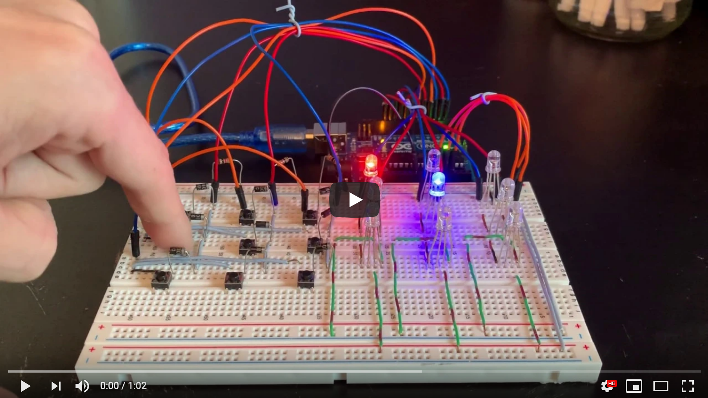

# Tic-Tac-Toe

#### Images and Videos

#### Project Overview

The hardware for this project consists of:
* 1 Arduino
* 9 RGB LEDs
* 9 switches
* 9 diodes (1 for each switch)
* 3 resistors (1 for each switch column)
* a handful of wires
* 1 breadboard

Both the LEDs and the switches are arranged into 3x3 matrices to resemble a
tic-tac-toe board with a 1-to-1 mapping between switches to LEDs.

The software for this project consists of 4 files:
* tictactoe.ino: this is the main file that controls the running game's logic
* board.cpp: this file contains the Board class that represents a game board
* game_config.h: this header file contains macros and game variables
* pins.h: this header file maps LEDs and switches to pins

To display the lights, I cycle through the rows of the LED matrix so that only
3 are lit up at a time. But, by doing this fast enough, all lights seem to be
lit up as the time between lighting up one row and another row is imperceivable.
For the switches I do a similar technique where I sense one column of switches
at a time for presses so that pressing multiple switches at a time doesn't
confuse the program.

To represent the game state (i.e. game board) I made a Board class in board.cpp
which holds a game's attributes such as the board and whose turn it is. There
are also a slew of functions in there for calculating heuristics for the AI,
making moves, undoing moves, and detecting wins, and more.

Within the tictactoe.ino file is the algorithm that controls the AI component
of this project. I use the minimax algorithm to choose the best move for the
AI based on a set of heuristics I developed. These heuristics revolve around
finding a winning board configuration or around the AI blocking the human
player's moves to result in tie. In my first pass at coding the algorithm,
creating a child state involved creating a new board object. Space wasn't an
issue here, but time was and this approach caused my lights to not display
while minimax was crunching. To remedy this, I instead create one board object
whose 3x3 board array I edit and un-edit in-place. This saved a good amount of
time allowed my algorithm to be a bit cleaner as well.

#### Design Decisions

The following notable design decision were made:

###### ~ Gameplay ~
* The starting player alternates with each game (in the 1st game the AI starts)
* If a player wins, their color (X = red, O = blue) flashes 6 times
* If there is a tie, the flashing colors alternate; 3 flashes for each player
* The AI is X (red) and the human player is O (blue); this doesn't change

###### ~ Hardware ~
* A 3x3 LED matrix is used to represent the game board
* A 3x3 switch matrix is used to select a move
* To allow for more digital pins, I hijacked some anolog pins to be digital :)
* Cables were managed by making small jumpers to span small breadboard gaps

###### ~ Software ~
* AI uses the minimax algorithm (default depth of 3) to make its moves
* Game state is abstracted to a Board class
* The AI doesn't use minimax for the first move to save on computation

#### Install/Compile/Run

1. Download the source code (unzip if necessary).
1. Open tictactoe.ino in the Arduino IDE.
1. Make sure Arduino and appropriate hardware is hooked up and press `Upload`.

Note: all files should reside in the same directory (and be at the same level).
